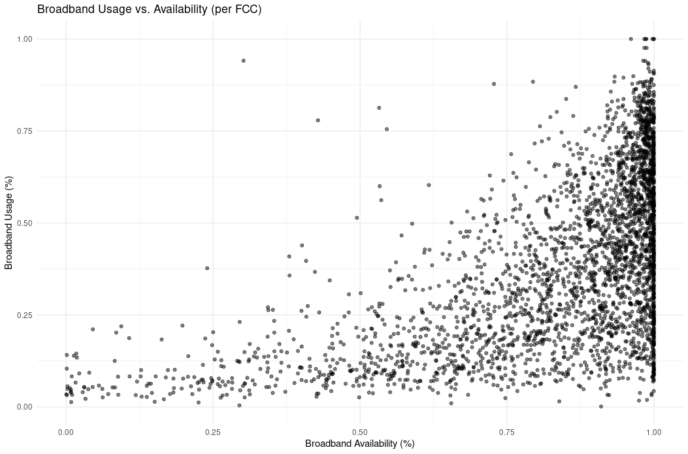
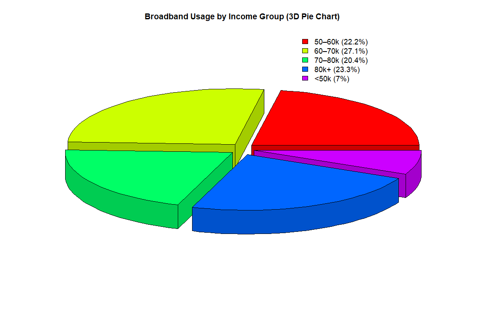
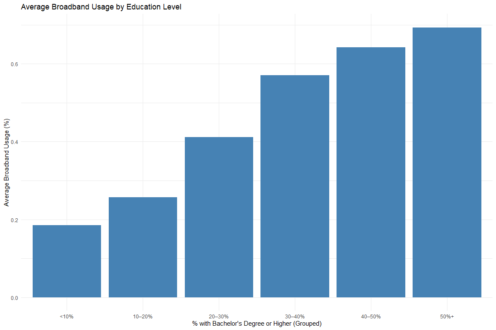
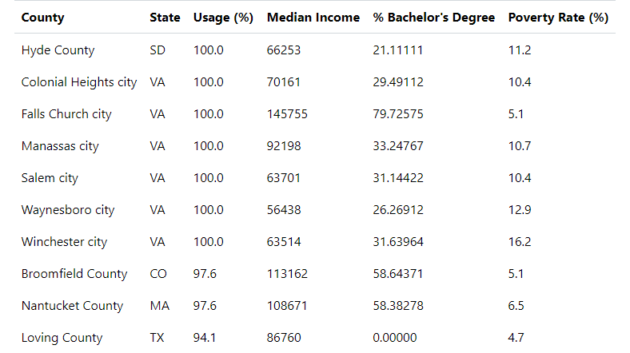
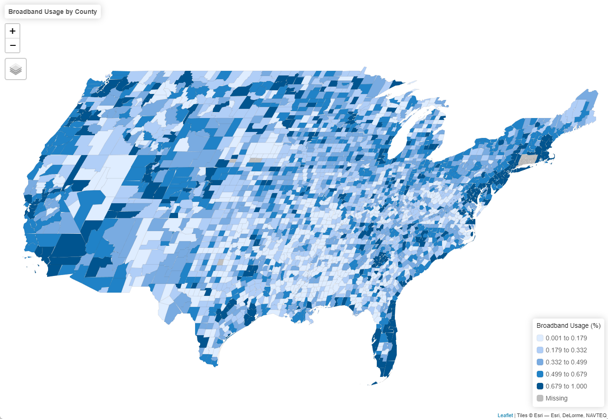
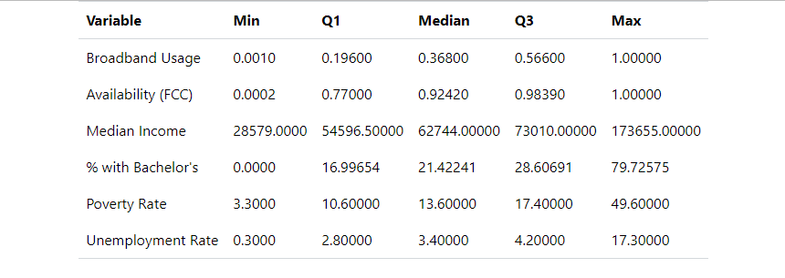
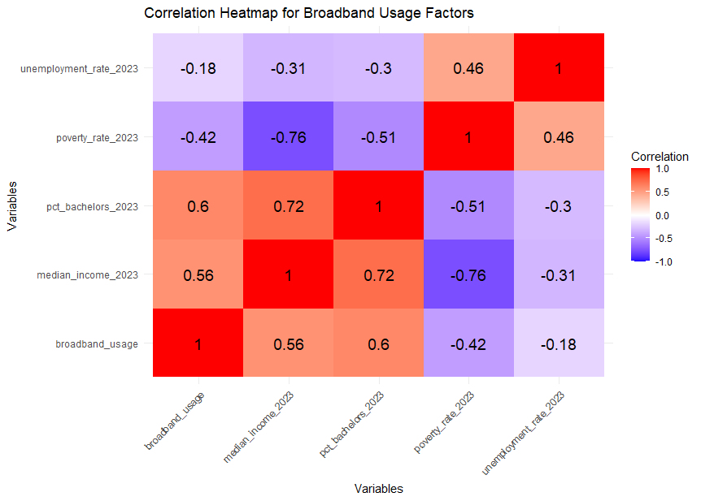
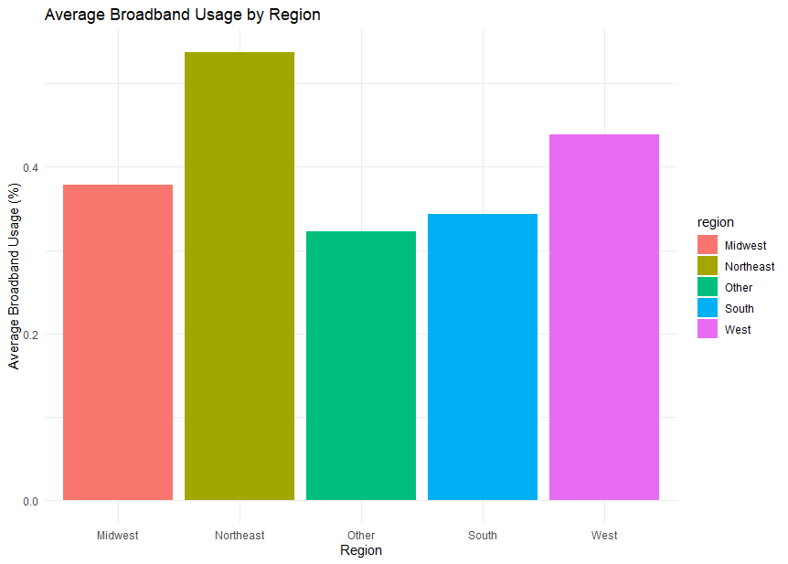
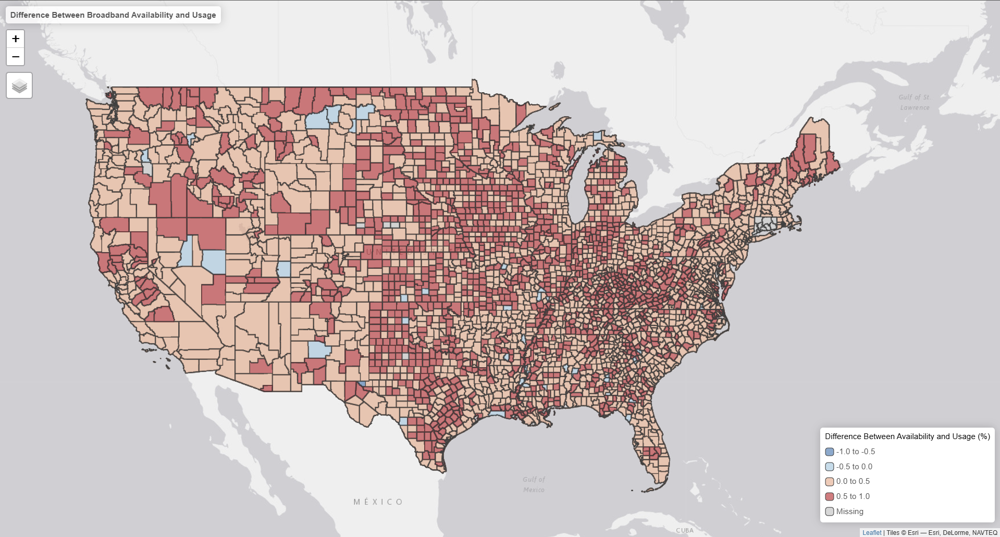

---

## Broadband Usage vs. Availability

{width=90%}

---

## Broadband Usage vs. Median Income

{width=90%}

---

## Broadband Usage vs. Education

{width=90%}

---

## Top 10 Counties by Broadband Usage

{width=85%}

---

## Broadband Usage by County (Choropleth Map)

{width=100%}

---

## Table of Summary Stats for Counties

{width=85%}

---

## Correlation Heatmap

{width=85%}

---

## Broadband usage by region

{width=85%}

---

## Map with Usage vs. Availability (The difference)

{width=85%}